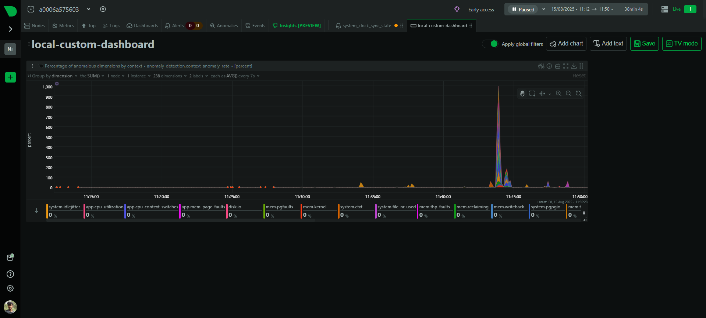
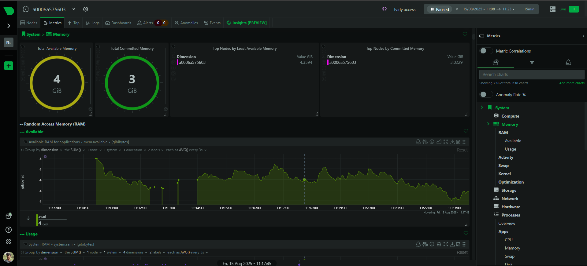
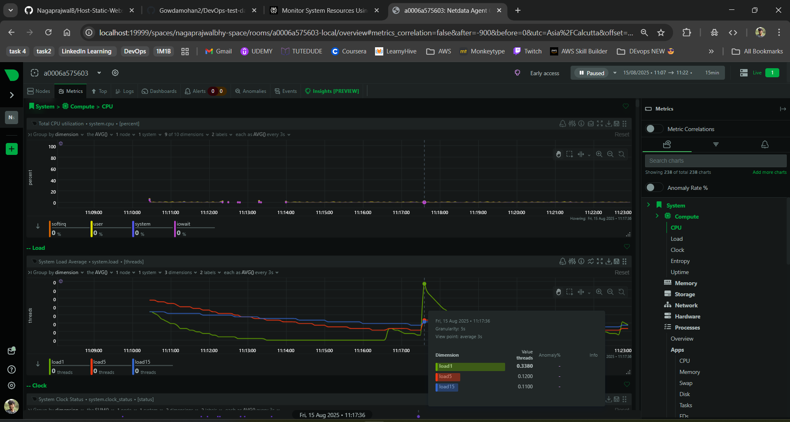
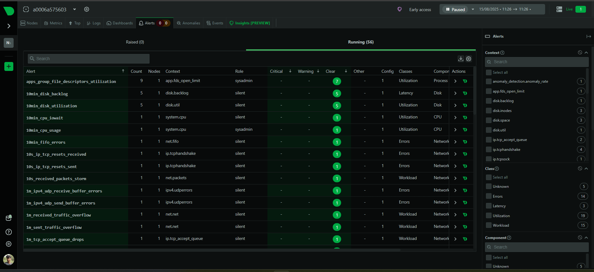

# 🖥️  Monitor System Resources Using Netdata

## Overview

This project demonstrates how to install and run [Netdata](https://www.netdata.cloud/), a free and open-source real-time monitoring tool, using Docker. Netdata provides detailed visualizations of system and application performance metrics such as CPU, memory, disk, network, and Docker containers.

## 🎯 Objective

- Install Netdata via Docker
- Visualize system and app performance metrics through a web dashboard
- Explore alerts, charts, and logs for comprehensive monitoring

## Prerequisites

- Docker installed on your system  

  For installation instructions, visit the official Docker documentation:  
```
https://docs.docker.com/get-docker/
```

## Getting Started

### Run Netdata Docker Container
```
docker run -d --name=netdata -p 19999:19999 netdata/netdata
```
This command pulls the Netdata Docker image (if not already available) and runs it in detached mode, exposing the dashboard on port `19999`.

### Access Netdata Dashboard
Open your web browser and navigate to:
```
http://localhost:19999
```
If running on a remote server, replace `localhost` with the server's IP address:
```
http://<SERVER_IP>:19999
```

### Monitor Metrics

Explore the Netdata dashboard to view:

- CPU usage
- Memory consumption
- Disk activity
- Network traffic
- Docker container metrics (if applicable)

Use the search feature and filter options to find specific metrics and charts.
### Alerts and Logs

- View alerts and alarms on the dashboard’s alert panel.
- Access Netdata logs inside the container by running:
```
docker exec -it netdata cat /var/log/netdata/error.log
```
## Stopping and Removing Netdata

To stop the running Netdata container:
```
docker stop netdata
```
To remove the container completely:
```
docker rm netdata
```

## Deliverables

### Dashboards


### Memory Usage


### Cpu Usage


### Alerts


## Outcome

* By completing this project, you will gain hands-on experience with lightweight, real-time monitoring of servers and applications. 
* Netdata’s intuitive dashboard helps you ensure system health and quickly respond to performance issues.